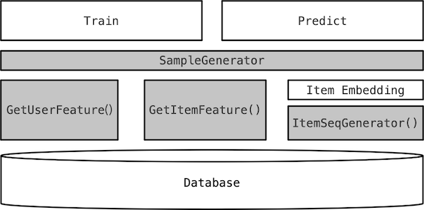

# edgeRec


Deep Learning(Item2vec Embedding + MLP) based Feature-Engineering & Training & Predict all in one Recommendation System that can run on small server or edge device.

# Demo

You can run the MovieLens training and predict demo by:

```shell
# download and unzip the SQLite DB file
wget https://github.com/auxten/edgeRec/files/9482338/movielens.db.zip && \
  unzip movielens.db.zip
# compile the edgeRec and put it in the current directory
GOBIN=`pwd` go install github.com/auxten/edgeRec@latest && \
  ./edgeRec
```

Wait for the message shown: `Listening and serving HTTP on :8080`.

Then test the API in another terminal:

```shell
curl --header "Content-Type: application/json" \
  --request POST \
  --data '{"userId":108,"itemIdList":[1,2,39]}' \
  http://localhost:8080/api/v1/recommend
```
Should get the response like this:

```json
{"itemScoreList":[
  {"itemId":1,"score":0.7517360474797006},
  {"itemId":2,"score":0.5240565619788571},
  {"itemId":39,"score":0.38496231172036016}
]}
```

So, with a higher score, user #108 may prefer movie #1 over #2 and #39.


# Quick Start

To create a deep learning based recommendation system, you need to follow the steps below:

if you prefer `show me the code`, just go to [MovieLens Example](example/movielens)

1. Implement the `recommend.RecSys` interface including func below:
    ```golang
   GetUserFeature(context.Context, int) (Tensor, error)
   GetItemFeature(context.Context, int) (Tensor, error)
   SampleGenerator(context.Context) (<-chan Sample, error)
   ```
2. Call the functions to `Train` and `StartHttpApi`

     ```golang
    model, _ = recommend.Train(recSys)
    recommend.StartHttpApi(model, "/api/v1/recommend", ":8080")
    ```

3. If you want better AUC with item embedding, you can implement the `recommend.ItemEmbedding` interface including func below:
    ```golang
    //ItemEmbedding is an interface used to generate item embedding with item2vec model
    //by just providing a behavior based item sequence.
    // Example: user liked items sequence, user bought items sequence, 
    //   user viewed items sequence
    type ItemEmbedding interface {
        ItemSeqGenerator() (<-chan string, error)
    }
    ```
   All you need to do is implement the functions of the gray part:
   

# Features

- [x] Pure Golang implementation, battery included.
- [ ] Parameter Server based Online Learning
- [x] Training & Inference all in one binary powered by golang
- Databases support
  - [x] MySQL support
  - [x] SQLite support
  - [ ] Database Aggregation accelerated Feature Normalization
- Feature Engineering
  - [x] Item2vec embedding
  - [ ] Rule based FE config
  - [ ] DeepL based Auto Feature Engineering
- Demo
  - [x] MovieLens Demo 
  - [ ] Android demo
  - [ ] iOS demo

# Benchmark

## Embedding

- Apple M1 Max
- Database: SQLite3
- Model: SkipGram, Optimizer: HierarchicalSoftmax
- WindowSize: 5
- Data: [MovieLens 10m](https://grouplens.org/datasets/movielens/10m/)
```
read 9520886 words 12.169282375s
trained 9519544 words 17.155356791s

Search Embedding of:
   59784 "Kung Fu Panda (2008)" Action|Animation|Children|Comedy

  RANK | WORD  | SIMILARITY  | TITLE & GENRES
-------+-------+-------------+-------------
     1 | 60072 |   0.974392  | Wanted (2008) Action|Thriller
     2 | 60040 |   0.974080  | Incredible Hulk, The (2008) Action|Fantasy|Sci-Fi
     3 | 60069 |   0.973728  | WALL·E (2008) Adventure|Animation|Children|Comedy|Romance|Sci-Fi
     4 | 60074 |   0.970396  | Hancock (2008) Action|Comedy|Drama|Fantasy
     5 | 63859 |   0.969845  | Bolt (2008) Action|Adventure|Animation|Children|Comedy
     6 | 57640 |   0.969305  | Hellboy II: The Golden Army (2008) Action|Adventure|Comedy|Fantasy|Sci-Fi
     7 | 58299 |   0.967733  | Horton Hears a Who! (2008) Adventure|Animation|Children|Comedy
     8 | 59037 |   0.966410  | Speed Racer (2008) Action|Adventure|Children
     9 | 59315 |   0.964556  | Iron Man (2008) Action|Adventure|Sci-Fi
    10 | 58105 |   0.963332  | Spiderwick Chronicles, The (2008) Adventure|Children|Drama|Fantasy

```

## Movie Recommend Performance

- Dataset: MovieLens 100k, split by [80%+20% userId randomly](example/movielens/readme.md)
- Code: [example/movielens](example/movielens)
- Training time: 28s
- AUC: 0.782

# Q&A

- Q: What model do you use?
- A: Just 2 layers of neural network and item2vec embedding.


- Q: Where can I use this?
- A: Simple system with a database. With 100 lines of golang, you got a better than nothing recommendation system.


- Q: Where wouldn't I use this?
- A: Large (100+ million) dataset using SOTA models.

# Thanks

To make this project work, quite a lot of code are copied and modified from the following libraries:
- Neural Network & Parameter Server: 
  - [gorgonia](https://github.com/gorgonia/gorgonia)
  - [goro](https://github.com/aunum/goro)
  - [go-deep](https://github.com/patrikeh/go-deep)
  - [pa-m/sklearn](https://github.com/pa-m/sklearn)
- Feature Engineering:
  - [go-featureprocessing](https://github.com/nikolaydubina/go-featureprocessing)
  - [featuremill](https://github.com/dustin-decker/featuremill)
  - [wego](https://github.com/ynqa/wego)
- FastAPI like framework:
  - [go-fastapi](https://github.com/sashabaranov/go-fastapi)
- Gopher logo with [GIMP](https://www.gimp.org/):
  - [ashleymcnamara/gophers](https://github.com/ashleymcnamara/gophers)
- [JetBrains](https://www.jetbrains.com/?from=auxten/EdgeRec) for providing free license for this project.

# Papers related

- [Deep Interest Network for Click-Through Rate Prediction](https://arxiv.org/abs/1706.06978)
- [Document Embedding with Paragraph Vectors](https://arxiv.org/abs/1507.07998)
- [EdgeRec: Recommender System on Edge in Mobile Taobao](https://arxiv.org/abs/2005.08416) // not very identical implementation